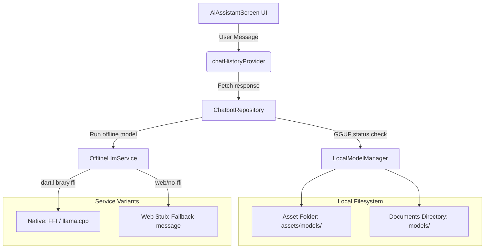

# ResQNet Offline AI Chatbot Implementation

This document describes the design, implementation, compilation safeguards, and usage instructions for the **ResQNet Offline AI Chatbot**.

---

## 1. Technical Architecture

ResQNet is designed to function as an emergency response app that operates in remote or disaster areas where internet connectivity is unavailable. Therefore, the AI assistant runs entirely on-device using a local LLM model in GGUF format, compiled using FFI bindings to native `llama.cpp`.



---

## 2. On-Device Model Management

The `LocalModelManager` (defined in [local_model_manager.dart](file:///Users/ayushtiwari/ResQNet/lib/features/ai_assistant/data/local_model_manager.dart)) manages GGUF files:

1. **Sideload Filesystem Scan**: It first scans the native app's local documents directory under a subfolder named `models/` for the configured GGUF file (e.g. `tinyllama-1.1b-chat-q4_k_m.gguf`). If found, it loads it directly from the local disk.
2. **Bundled Asset Rollout**: If the file is not in the documents directory, it scans the Flutter Asset manifest. If the file is bundled inside the assets, it reads the bundle streams and copies it out into the documents directory before loading it into memory (since native `llama.cpp` requires direct filesystem paths and cannot read directly from compressed/obfuscated Flutter assets).
3. **Graceful Failures**: If no model is found, the UI displays a clean status card indicating that the model is missing, explaining where the file must be copied, and showing a fallback message without crashing.

---

## 3. Web Compilation & Native FFI Safeguards

Since the Flutter project compiles to multiple targets, including Web (Chrome), importing `dart:ffi` or `package:llm_llamacpp` directly on web targets results in runtime compiler crashes because `dart:ffi` is not supported on the web.

We resolved this with a dual-layer protection mechanism:

### Layer A: Conditional Compilation & Exports
The `OfflineLlmService` exposes a single entrypoint in [offline_llm_service.dart](file:///Users/ayushtiwari/ResQNet/lib/features/ai_assistant/data/offline_llm_service.dart):
```dart
export 'offline_llm_service_interface.dart';
export 'offline_llm_service_stub.dart'
    if (dart.library.ffi) 'offline_llm_service_native.dart';
```
* **Web Compile Target**: Automatically loads [offline_llm_service_stub.dart](file:///Users/ayushtiwari/ResQNet/lib/features/ai_assistant/data/offline_llm_service_stub.dart) which is FFI-free and returns a clean web fallback warning message.
* **Native Compile Target**: Automatically loads [offline_llm_service_native.dart](file:///Users/ayushtiwari/ResQNet/lib/features/ai_assistant/data/offline_llm_service_native.dart) which implements local FFI bindings to native `llama.cpp` using the package `llm_llamacpp`.

### Layer B: Native Asset Build Hook Patches
`package:llm_llamacpp` registers a `build.dart` script that automatically compiles the native C++ source of `llama.cpp` for the current platform. However, the build hook fails under web targets because the target architecture configuration resolves to null.
To prevent this, the package was copied locally to `llm_llamacpp/` and its `hook/build.dart` build task was wrapped in a safety `try-catch` block to skip compiling C++ sources when compiling for non-native platforms like Web.

---

## 4. Prompt Engineering & Emergency Guardrails

The system prompt builder (defined in [offline_prompt_builder.dart](file:///Users/ayushtiwari/ResQNet/lib/features/ai_assistant/data/offline_prompt_builder.dart)) enforces strict behaviors:
* **Calm & Supportive Tone**: Keeps instructions logical and action-oriented.
* **Multilingual support**: Natively matches and responds in Hindi, English, or Hinglish based on the user's input.
* **Emergency Disclaimer**: Instructs the user to contact real emergency lines first, and makes sure the assistant does not pretend it can dial or dispatch emergency responders.

---

## 5. Model Sideloading Instructions

Because GGUF model files are large (from ~600MB to 2.5GB), sideloading them is the best practice to avoid massive initial bundle sizes. Follow the instructions below to sideload the default model `tinyllama-1.1b-chat-q4_k_m.gguf` (available on HuggingFace or similar LLM hosting sites) for each platform:

### 📱 Android
1. Connect your Android device to your computer.
2. Navigate to your app's standard documents folder:
   `/Android/data/com.example.resqnet/files/models/`
3. Copy your GGUF file here.

### 🍏 iOS
1. Connect your iPhone to your computer.
2. In Finder (macOS Catalina or later) or iTunes, select your device.
3. Under the **Files** tab, find **ResQNet**.
4. Create a folder named `models` inside ResQNet's documents folder, and drag the GGUF file into it.

### 💻 macOS (Desktop Build)
1. Open Finder and press `Cmd + Shift + G` to search folder paths.
2. Search for:
   `~/Library/Containers/com.example.resqnet/Data/Documents/`
3. Create a folder named `models` inside it.
4. Copy the GGUF file to this `models` directory.

### 🪟 Windows
1. Go to your local application data path:
   `C:\Users\<Your-Username>\Documents\models\`
2. Place the GGUF file inside it.

---

## 6. Verification Checklist

* [x] **Web preview compilation check**: Compiles successfully via `flutter run -d chrome`.
* [x] **Web responsiveness check**: Gesture taps on recommended chips, input focus, typing, and clear messages perform smoothly.
* [x] **Web fallback warning check**: Clicking send shows the FFI missing exception warning without crashing.
* [x] **Unit tests check**: `flutter test` completes successfully.
